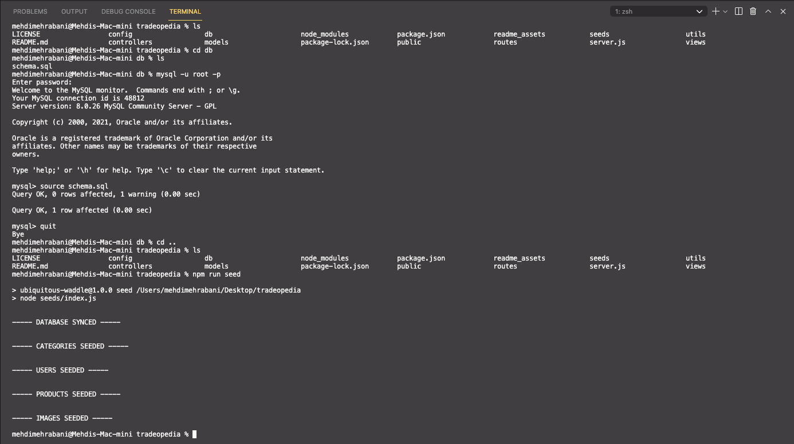

# ideal-potato

## Project 2: Tradeopedia

<a href="https://choosealicense.com/licenses/mit" target="_blank"></a>

## Table of Contents:

1. [Description](#description)
1. [Technologies](#technologies)
1. [Multer](#multer)
1. [Installation](#installation)
1. [Usage](#usage)
1. [Video](#video)
1. [Contributing](#contributing)
1. [License](#license)
1. [Questions](#questions)

## Description

Tradeopedia is an e-commerce market place website that connects sellers and buyers within their city location. In the past few years, people have developed new skills as a result of work from home due to covid, and these skills have increased the demand for online storefronts. As a result, we wanted to create an e-commerce marketplace for the "everyday artist".

To view the final app deployed on Heroku, please click on the following [link](https://afternoon-shore-04761.herokuapp.com/).

## Technologies

1. [Node.js](https://www.npmjs.com/package/inquirer) Packages

   a. [bcrypt](https://www.npmjs.com/package/bcrypt)

   b. [connection-session-sequelize](https://www.npmjs.com/package/connect-session-sequelize)

   c. [dotenv](https://www.npmjs.com/package/dotenv)

   d. [express](https://www.npmjs.com/package/express)

   e. [express-handlebars](https://www.npmjs.com/package/express-handlebars)

   f. [express-session](https://www.npmjs.com/package/express-session)

   g. [morgan](https://www.npmjs.com/package/morgan)

   h. [multer](https://www.npmjs.com/package/multer)

   i. [mysql2](https://www.npmjs.com/package/mysql2)

   j. [nodemon](https://www.npmjs.com/package/nodemon)

   k. [sequelize](https://www.npmjs.com/package/sequelize)

2. CSS Framework

   a. [Bootstrap](https://getbootstrap.com/docs/5.1/getting-started/introduction/)

   b. [Boxicons](https://boxicons.com/)

3. Deployment

   a. [Heroku](https://devcenter.heroku.com/)

## Multer

One of the requirements for this project was to work with a technology that we had not worked with previously. For this reason, we decided to highlight the use of the Multer npm package. See below for description per multer documentation.

> "Multer is a node.js middleware for handling multipart/form-data, which is primarily used for uploading files."

If you want to review the documentation page check out the following [link](https://www.npmjs.com/package/multer)

### Multer vs. Tradeopedia

During the initial phases of putting this project together, we realized quickly that the process of uploading of images to the server will be a one of the more difficult tasks. After some research, we decided to choose a technology that would make the handling of image file uploads easier.

## Installation

- Before cloning the repository, please ensure you have node.js installed as this app requires the installing of npm packages. If you do not have node.js installed, start with steps 1 and 2. If you have node.js installed and confirmed, you can skip steps 1 and 2 and begin on step 3.

  1.  [Node.js Download Page](https://nodejs.org/en/download/)

  2.  After install, check with command line to ensure setup is correct.

      a. Open your terminal

      b. Type the below command. If you see a version it means you have installed node.js correctly.

      ```bash
      node -v
      ```

  3.  Clone repository and open in VS Code.

  4.  Open Terminal in VS Code

      a. Shortcut = CTRL + `

  5.  Install all the dependencies by typing the below command.

      ```bash
      npm install
      ```

  6.  Once you hit enter, the correct dependencies for allowing you to use this application will be automatically installed.

  7.  The final step is to update the .env.EXAMPLE file with your MySQL password and user info. Please ensure you also remove the ".EXAMPLE" from the file path.

  ## Usage

- Once you've completed the installation section guidelines, you'll need to first create the database in MySQL before running the application. Follow the below steps and use the image at the end of this section for guidance.

  1.  Open Terminal in VS Code

      a. Shortcut = CTRL + `

  2.  Navigate to the folder called 'db'.

  3.  Log into your MySQL and type the below command.

      ```bash
      source schema.sql
      ```

  4.  When you've received confirmation that the database has been created, exit MySQL so that you can run the application. Type the below command to exit MySQL.

      ```bash
      quit
      ```

  - If you would like to use the example tech blog database, I've placed a json file in the seeds folder and you can save the data to MySQL by running the below command. If not, go to step 5.

    ```bash
      npm run seeds
    ```

  5.  To run the application, you'll need to navigate back to the main folder where the file `server.js` is saved and type the below command.

      ```bash
      node server.js
      ```

### Steps To Create Database In MySQL



## Video


## Contributing

Please open a Github issues request and we’ll review and respond as soon as I can.

## License

<a href="https://choosealicense.com/licenses/mit" target="_blank">MIT License</a>

## Questions

Github Portfolio Link: [Mehdi Mehrabani](https://github.com/mmehr1988)<br>
